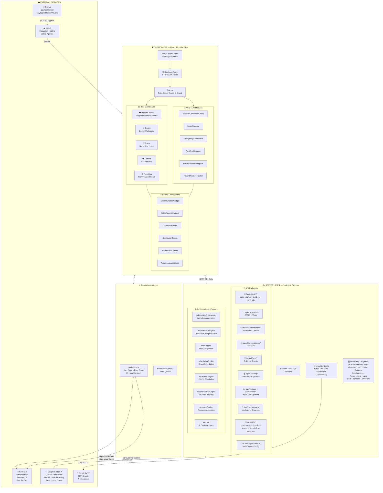
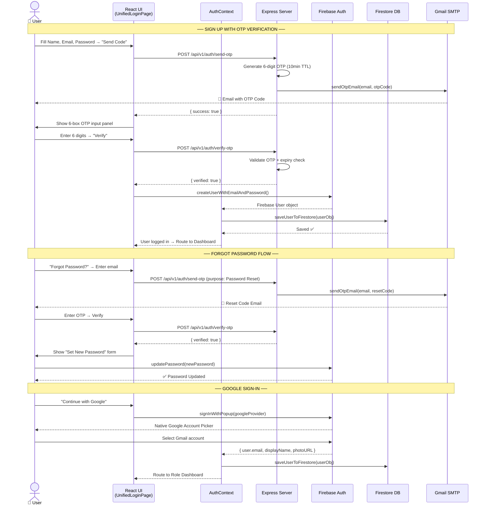
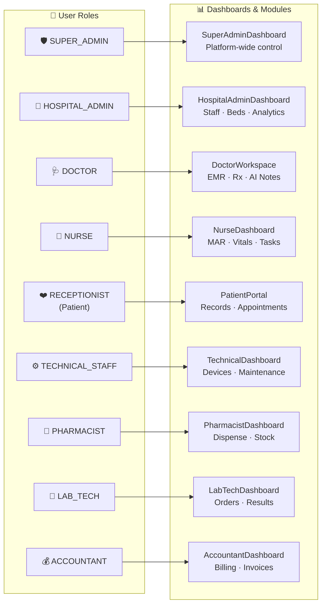
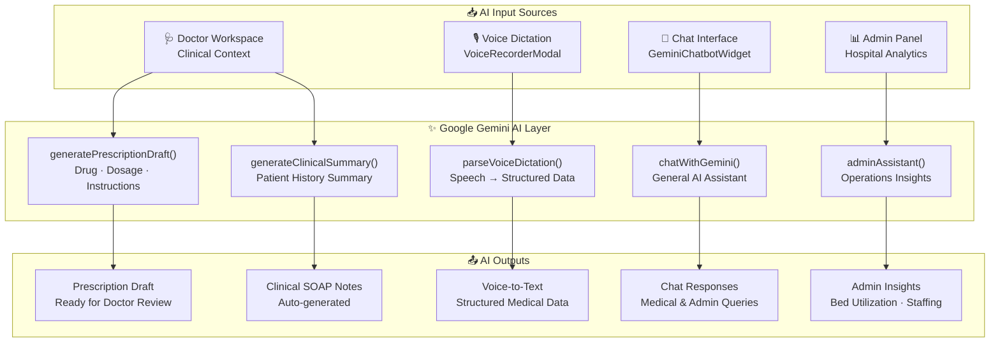
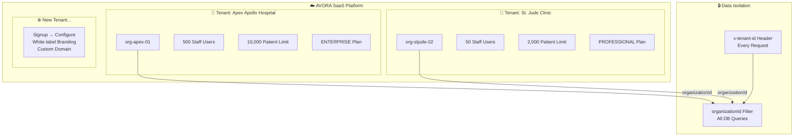
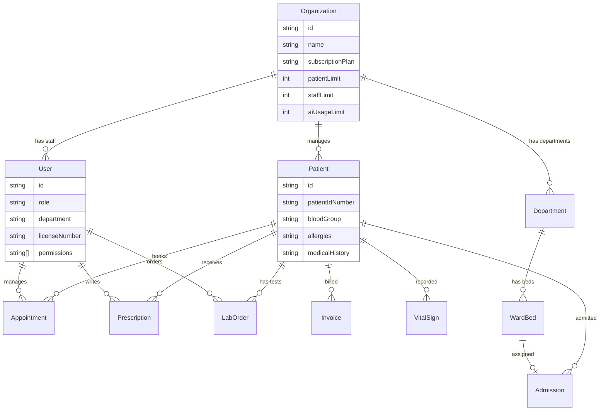
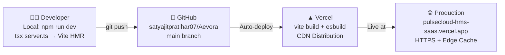

# AVORA HMS — System Design & Architecture
## Presentation-Ready Technical Overview

---

## 🏗️ System Architecture Overview

---

## 🔐 Authentication & OTP Flow

---

## 🏥 Role-Based Access Control Matrix

---

## 🤖 AI Integration Architecture

---

## 📦 Technology Stack Summary

| Layer | Technology | Purpose |
|---|---|---|
| **Frontend** | React 19 + TypeScript + Vite | SPA with hot reload |
| **Styling** | TailwindCSS v4 + Inline CSS | Responsive design system |
| **Animations** | Motion (Framer Motion) | Micro-animations & transitions |
| **Charts** | Recharts | Analytics dashboards |
| **Icons** | Lucide React | 500+ medical & UI icons |
| **Backend** | Node.js + Express 4 | REST API server |
| **Auth** | Firebase Auth v12 | Email/Password + Google OAuth |
| **Database (Cloud)** | Firestore | User profiles + session data |
| **Database (Runtime)** | In-Memory Store (db.ts) | Multi-tenant HMS data |
| **AI Engine** | Google Gemini 2.0 | Clinical AI + voice parsing |
| **Email** | Nodemailer + Gmail SMTP | OTP delivery + notifications |
| **Deployment** | Vercel (CDN + Edge) | Production hosting |
| **Source Control** | GitHub | CI/CD integration |

---

## 🌐 Multi-Tenant Architecture

---

## 🗂️ Key Data Models

---

## 🚀 Deployment Pipeline

---

## 📊 Feature Matrix by Role

| Feature | Admin | Doctor | Nurse | Patient | Tech |
|---|:---:|:---:|:---:|:---:|:---:|
| Staff Management | ✅ | — | — | — | — |
| Patient Directory | ✅ | ✅ | ✅ | — | — |
| Doctor Workspace (EMR) | — | ✅ | — | — | — |
| AI Prescription Draft | — | ✅ | — | — | — |
| Voice Dictation | — | ✅ | — | — | — |
| MAR / Vitals | — | — | ✅ | — | — |
| Nursing Task Board | — | — | ✅ | — | — |
| Patient Health Record | — | — | — | ✅ | — |
| Appointment Booking | ✅ | ✅ | — | ✅ | — |
| Billing & Invoices | ✅ | — | — | ✅ | — |
| Bed Management | ✅ | — | ✅ | — | — |
| Lab Orders | ✅ | ✅ | — | ✅ | — |
| Device Monitoring | — | — | — | — | ✅ |
| Maintenance Tickets | — | — | — | — | ✅ |
| Hospital Command Center | ✅ | — | — | — | — |
| Emergency Coordinator | ✅ | ✅ | — | — | — |
| AI Analytics | ✅ | ✅ | — | — | ✅ |
| Audit Logs | ✅ | — | — | — | ✅ |
| White-label Settings | ✅ | — | — | — | — |

---

> **AVORA HMS** — *AI-Powered Hospital Operating System*  
> Built with React 19 · Firebase · Google Gemini · Node.js · Vercel  
> © 2025 AVORA Technologies · HIPAA & NABH Certified Architecture  
> 🌐 https://pulsecloud-hms-saas.vercel.app
